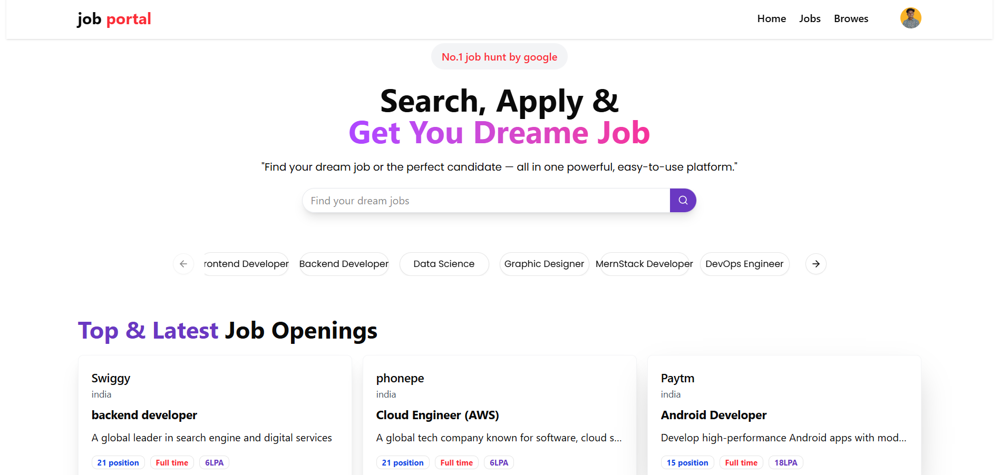
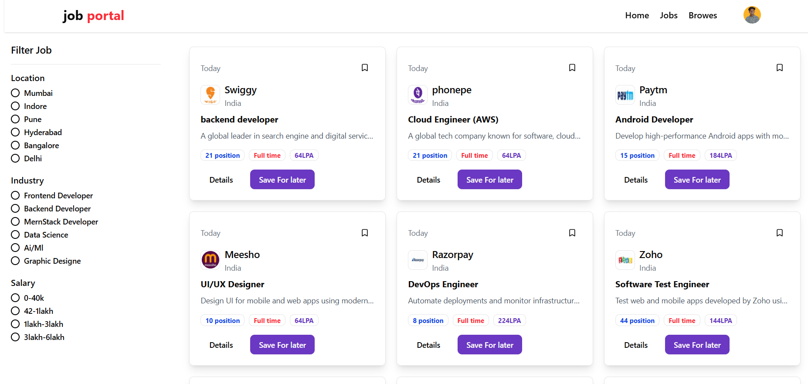
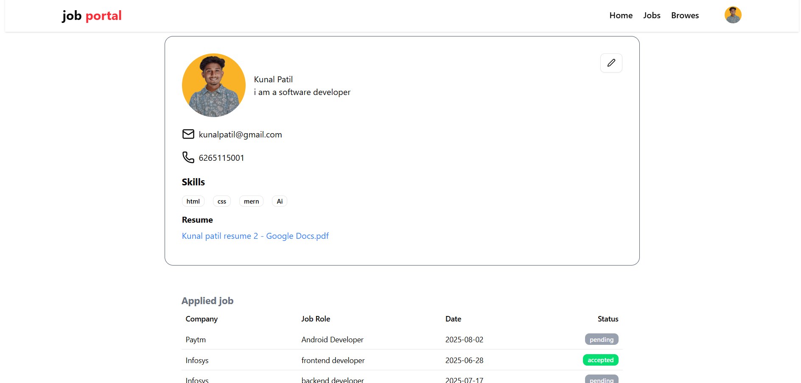
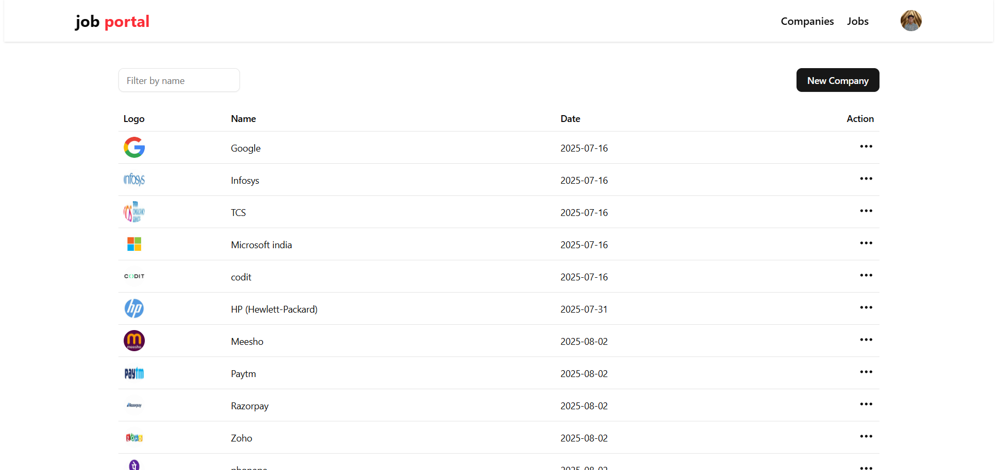
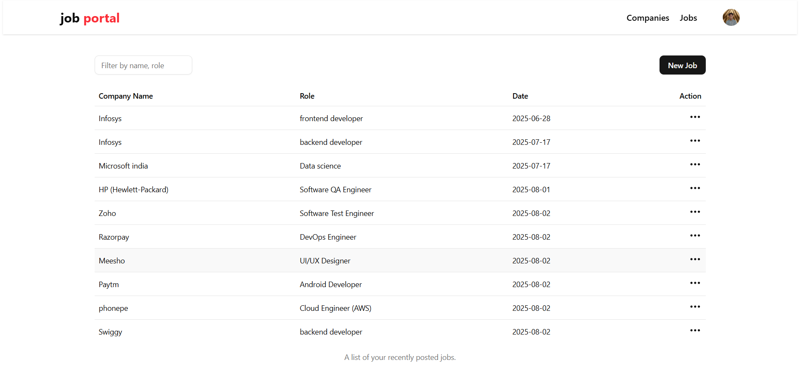

# 💼 Job Portal - MERN Stack Project

A full-featured job portal web app where users can register, search jobs, apply with resumes, and companies can post and manage job listings.

🔗 **Live Site:** [https://job-portal-1-95gk.onrender.com](https://job-portal-1-95gk.onrender.com)  
📦 **GitHub Repo:** [https://github.com/kunalpatil624/job-portal](https://github.com/kunalpatil624/job-portal)

---

## 📌 Features

- 👤 User Registration & Login (JWT + Cookies)
- 🔍 Search & Filter Jobs by Title, Location, Salary
- 🧾 Resume Upload using Cloudinary
- 🏢 Company Setup with Logo Upload
- 📥 Apply to Jobs with Auto Resume Attachment
- 📄 View and Manage Job Applications
- 🎨 Responsive UI using Tailwind CSS
- ⚙️ Admin & Company Role Management (basic)

---

## ⚙️ Tech Stack

| Layer        | Technologies |
|--------------|--------------|
| **Frontend** | React.js, Tailwind CSS, Redux Toolkit, Framer Motion |
| **Backend**  | Node.js, Express.js, MongoDB, Mongoose |
| **Other**    | Cloudinary, Multer, JWT Auth, Axios |

---

## 🧪 Screenshots

## Homepage

## Filter jobs

## User profile

## Admin Companies page

## Admin jobs

---

## 🧑‍💻 Author
------------

**Kunal Patil**  
🔗 [LinkedIn](https://www.linkedin.com/in/kunal-patil-504a752a0/)  
🐙 [GitHub](https://github.com/kunalpatil624)

